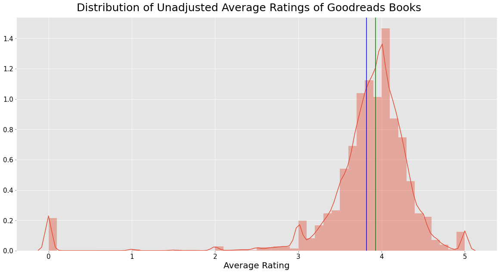
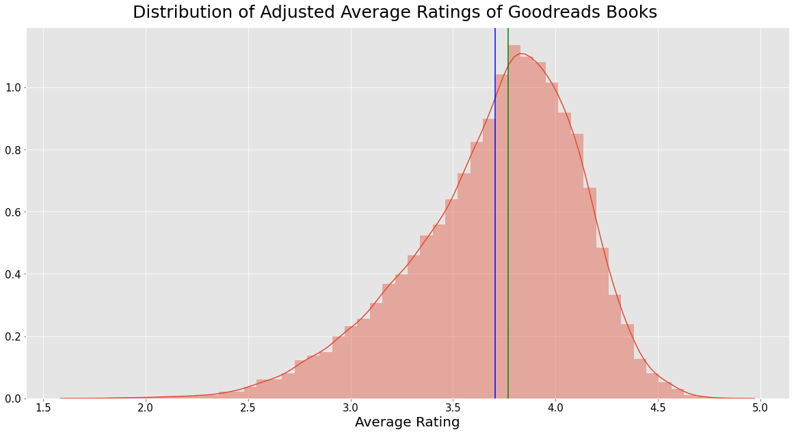
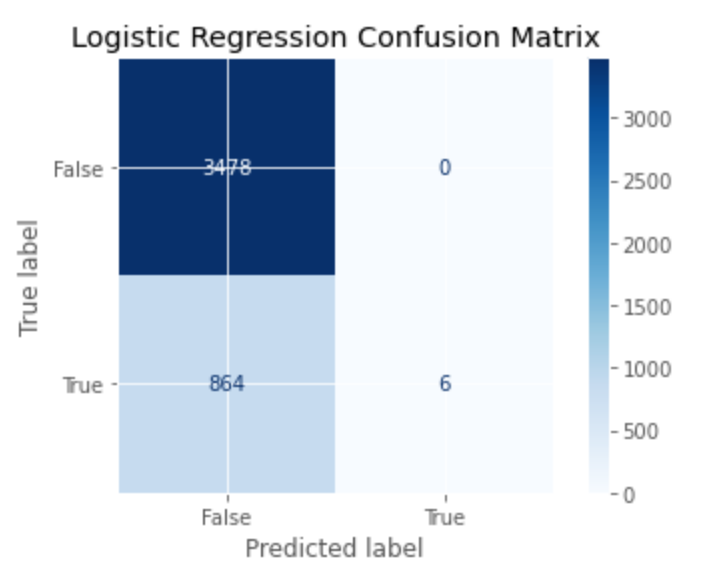
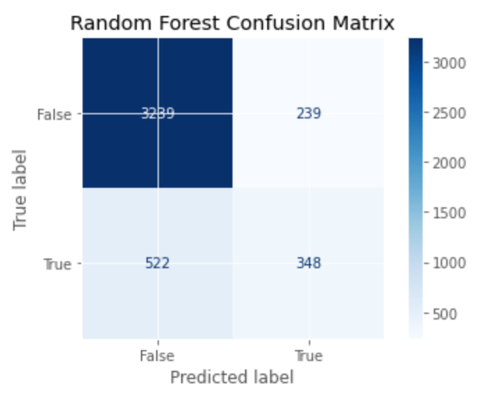
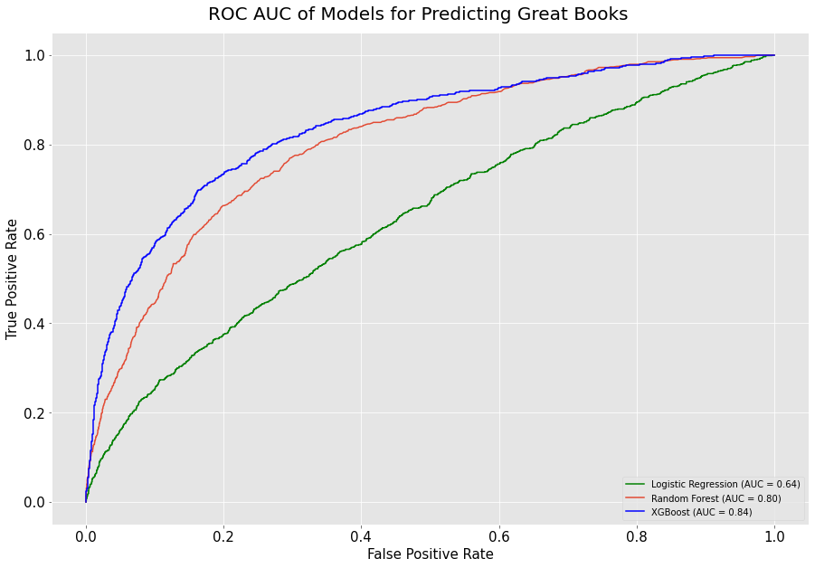
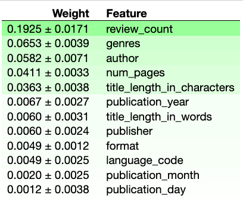

{: .center-block :}
<p align="center">Photo of old books by [Ed Robertson](https://unsplash.com/@eddrobertson) on [Unsplash](https://unsplash.com/)</p>

## What
This is a data set of the first 50,000 book ids pulled from Goodreads' API on July 30th, 2020. A few thousand ids did not make it through because the book id was changed, the URL or API broke, or the information was stored in an atypical format.

## Why
From the reader's perspective, books are a multi-hour commitment of learning and leisure (they don't call it **Good**reads for nothing). From the author's and publisher's perspectives, books are a way of living (with some learning and leisure too). In both cases, knowing which factors explain and predict great books will save you time and money. Because while different people have different tastes and values, knowing how a book is rated in general is a sensible starting point. You can always update it later.

## Environment
It's good practice to work in a virtual environment, a sandbox with its own libraries and versions, so we'll make one for this project. There are several ways to do this, but we'll use [Anaconda](https://www.anaconda.com/products/individual). To create and activate an Anaconda virtual environment called 'gr' (for Goodreads) using Python 3.7, run the following commands in your terminal or command line:

<script src="https://gist.github.com/ryankoul/26f74ac8a2df83aa02f7e688fc06651a.js"></script>

# Installations
You should see ‘gr’ or whatever you named your environment at the left of your prompt. If so, run these commands. Anaconda will automatically install any dependencies of these packages, including matplotlib, numpy, pandas, and scikit-learn.

<script src="https://gist.github.com/ryankoul/c3ce2d189f2ca640224dbb66ff0c9c67.js"></script>

# Imports
<script src="https://gist.github.com/ryankoul/c3ce2d189f2ca640224dbb66ff0c9c67.js"></script>

# Data Collection
We pull the first 50,000 book ids and their associated information using a lightweight wrapper around the Goodreads API made by [Michelle D. Zhang](https://medium.com/@mdzhang) (code and documentation [here](https://github.com/mdzhang/goodreads-api-client-python)), then write each as a dictionary to a JSON file called `book_data`.

<script src="https://gist.github.com/ryankoul/0a5f9934925651cae8f6b435c23df86a.js"></script>

# Data Cleaning
We’ll define and describe some key functions below, but we’ll run them in one big wrangle function later.

## Wilson Lower Bound
A rating of 4 stars based on 20 reviews and a rating of 4 stars based on 20,000 reviews are not equal. The rating based on more reviews has less uncertainty about it and is therefore a more reliable estimate of the “true” rating. In order to properly define and predict great books, we must transform `average_rating` by putting a penalty on uncertainty.

We’ll do this by calculating a [Wilson Lower Bound](https://www.evanmiller.org/how-not-to-sort-by-average-rating.html), where we estimate the confidence interval of a particular rating and take its lower bound as the new rating. Ratings based on tens of thousands of reviews will barely be affected because their confidence intervals are narrow. Ratings based on fewer reviews, however, have wider confidence intervals and will be scaled down more.

**Note**: We modify the formula because our data is calculated from a 5-point system, not a binary system as described by Wilson. Specifically, we decrement `average_rating` by 1 for a conservative estimate of the true non-inflated rating, and then normalize it. If this penalty is too harsh or too light, more ratings will over time raise or lower the book’s rating, respectively. In other words, with more information, this adjustment is self-correcting.

<script src="https://gist.github.com/ryankoul/802c8e74995291371083192f9533dcbf.js"></script>

## Genres
Goodreads’ API returns ‘shelves’, which encompass actual genres like “science-fiction” and user-created categories like “to-read”. We extracted only the 5 most popular shelves when pulling the data to limit this kind of clean-up; here, we’ll finish the job.

After some inspection, we see that these substrings represent the bulk of non-genre shelves. We’ll filter them out using a regular expression. **Note**: We use two strings in the regex so the line doesn’t get cut off. Adjacent strings inside parantheses are joined at compile time.

<script src="https://gist.github.com/ryankoul/6cd7546489a79abe8a9fcbd36dca155d.js"></script>


# All-in-one Cleaning
Now we’ll build and run one function to wrangle the data set. This way, the cleaning is more reproducible and debug-able.

<script src="https://gist.github.com/ryankoul/f15b015a14c8879974e675adbdf25783.js"></script>

# Compare Unadjusted and Adjusted Average Ratings
Numerically, the central measures of tendency of mean (in blue) and median (in green) slightly decrease, and the variance significantly decreases.

Visually, we can see the rating adjustment in the much smoother and wider distribution (although note that the x-axis is truncated). This is from eliminating outlier books with no or very few ratings, and scaling down ratings with high uncertainty.

<script src="https://gist.github.com/ryankoul/862d74002539cf0f362356d0b0f61654.js"></script>




```python
Unadjusted mean: 3.82
Unadjusted median: 3.93
Unadjusted variance: 0.48
```

<script src="https://gist.github.com/ryankoul/5c28638fa9824a23e0587b51bd22745f.js"></script>



```python
Adjusted mean: 3.71
Adjusted median: 3.77
Adjusted variance: 0.17
```

# Data Leakage
Because our target is derived from ratings, training our model using ratings is effectively training with the target. To avoid distorting the model, we must drop these columns.

It is also possible that `review_count` is a bit of leakage, but it seems more like a proxy for *popularity*, not greatness, in the same way that pop(ular) songs are not often considered classics. Of course, we'll reconsider this if its permutation importance is suspiciously high.

<script src="https://gist.github.com/ryankoul/9b3810fc01f79d407fc9057277837cec.js"></script>

# Split Data
We’ll do an 85/15 train-test split, then re-split our train set to make the validation set about the same size as the test set.

<script src="https://gist.github.com/ryankoul/30336d57e61bd41952c635290b4dd8f2.js"></script>

```python
(20281, 12) (20281,) (4348, 12) (4348,) (4347, 12) (4347,)
```

# Evaluation Metrics
With classes this imbalanced, accuracy (correct predictions / total predictions) can become misleading. There just aren’t enough true positives for this fraction to be the best measure of model performance. So we’ll also use ROC AUC, a Receiver Operator Characteristic Area Under the Curve. Here is a colored drawing of one, courtesy of Martin Thoma.


The ROC curve is a plot of a classification model’s true positive rate (TPR) against its false positive rate (FPR). The ROC AUC is the area from [0, 1] under and to the right of this curve. Since optimal model performance maximizes true positives and minimizes false positives, the optimal point in this 1x1 plot is the top left, where the area under the curve (ROC AUC) = 1.

For imbalanced classes such as `great`, ROC AUC outperforms accuracy as a metric because it better reflects the relationship between true positives and false positives. It also depicts the classifier’s performance across all its values, giving us more information about when and where the model improves, plateaus, or suffers.


# Fit Models
Predicting great books is a binary classification problem, so we need a classifier. Below, we’ll encode, impute, and fit to the data a linear model (Logistic Regression) and two tree-based models (Random Forests and XGBoost), then compare them to each other and to the majority baseline. We’ll calculate their accuracy and ROC AUC, and then make a visualization.
Majority Class Baseline

First, by construction, `great` books are the top 20% of books by Wilson-adjusted rating. That means our majority class baseline (no books are great) has an accuracy of 80%.

Second, this “model” doesn’t improve, plateau, or suffer since it has no discernment to begin with. A randomly chosen positive would be treated no differently than a randomly chosen negative. In other wrods, its ROC AUC = 0.5.

<script src="https://gist.github.com/ryankoul/46fe24768978068fc6862394bf9b7c2d.js"></script>

```python
Baseline Validation Accuracy: 0.8
Baseline Validation ROC AUC: 0.5
```

## Logistic Regression
Now we’ll fit a linear model with cross-validation, re-calculate evaluation metrics, and plot a confusion matrix.

<script src="https://gist.github.com/ryankoul/bd48e519076bdb19216f5e46eeb2134a.js"></script>

```python
Baseline Validation Accuracy: 0.8
Logistic Regression Validation Accuracy: 0.8013
Baseline Validation ROC AUC: 0.5
Logistic Regression Validation ROC AUC: 0.6424
```

## Logistic Regression Confusion Matrix
<script src="https://gist.github.com/ryankoul/3f77035862658ffcdee697f35815287e.js"></script>



# Random Forest Classifier
Now we’ll do the same as above with a tree-based model with bagging (**B**ootstrap **AGG**regation).

<script src="https://gist.github.com/ryankoul/f00a21c17798cdc64db9479f3b07dc56.js"></script>

```python
Baseline Validation Accuracy: 0.8
Logistic Regression Validation Accuracy: 0.8013
Random Forest Validation Accuracy: 0.8222

Majority Class Baseline ROC AUC: 0.5
Logistic Regression Validation ROC AUC: 0.6424
Random Forest Validation ROC AUC: 0.8015
```

## Random Forest Confusion Matrix
<script src="https://gist.github.com/ryankoul/ca34ec0a189ba4799ee67323a824955c.js"></script>



## XGBoost Classifier
Now we’ll do the same as above with another tree-based model, this time with boosting.

<script src="https://gist.github.com/ryankoul/7226e8744f2fe069f40d8a564dd35e63.js"></script>

```python
Baseline Validation Accuracy: 0.8
Logistic Regression Validation Accuracy: 0.8013
Random Forest Validation Accuracy: 0.8245
XGBoost Validation Accuracy: 0.8427

Majority Class Baseline ROC AUC: 0.5
Logistic Regression Validation ROC AUC: 0.6424
Random Forest Validation ROC AUC: 0.8011
XGBoost Validation ROC AUC 0.84
```

XGBClassifier performes the best in accuracy and ROC AUC.

<script src="https://gist.github.com/ryankoul/504d71cb4c65040c23bbc4178967973e.js"></script>

# Graph and Compare Models’ ROC AUC
Below, we see that logistic regression lags far behind XGBoost and Random Forests in achieving a high ROC AUC. Among the top two, XGBoost initially outperforms RandomForest, and then the two roughly converge around FPR=0.6. We see in the lower right legend, however, that XGBoost has the highest AUC of 0.84, followed by Random Forest at 0.80 and Logistic Regression at 0.64.

In less technical language, the XGBoost model was the best at classifying great books as great (true positives) and not classifying not-great books as great (false positives).

<script src="https://gist.github.com/ryankoul/505724d82b149a7693c3dddbe77814c8.js"></script>



# Permutation Importances
One intuitive way of identifying whether and to what extent something is important is by seeing what happens when you take it away. This is the best in a situation unconstrained by time and money.

But in the real world with real constrains, we can use permutation instead. Instead of eliminating the column values values by dropping them, we eliminate the column’s *signal* by randomizing it. If the column really were a predictive feature, the order of its values would matter, and shuffling them around would substantially dilute if not destroy the relationship. So if the feature’s predictive power *isn’t* really hurt or is even helped by randomization, we can conclude that it is not actually important.

Let’s take a closer look at the permutation importances of our XGBoost model. We’ll have to refit it to be compatible with eli5.

<script src="https://gist.github.com/ryankoul/5c4f83686ee396990e9084a6034cdd98.js"></script>

## Permutation Importance Analysis

As we assumed at the beginning, `review_count` matters but it is not suspiciously high. This does not seem to rise to the level of data leakage. What this means is that if you were wondering what book to read next, a useful indicator is how many reviews it has, a proxy for how many others have read it.

We see that `genres` is the second most important feature for ROC AUC in the XGBoost model.

`author` is third, which is surprising and perhaps a bit concerning. Because our test set is not big, the model may just be identifying authors whose books are the most highly rated in wilson-adjusted terms, such as J.K. Rowling and Suzanne Colins. More data would be useful to test this theory.

Fourth is `num_pages`. I thought this would be higher for two reasons:
1. Very long books’ ratings seem to have a bit of a ratings bias upward in that people willing to start and finish them will rate them higher. The long length screens out less interested marginal readers, who probably wouldn’t have rated the book highly in the first place.
2. Reading and showing off that you’re reading or have read long books is a sign of high social status. The archetypal example: Infinite Jest.

# Takeaway
We’ve seen how to collect, clean, analyze, visualize, and model data. Some actionable takeaways are that when and who publishes a book doesn’t really matter, but its review count does — the more reviews, the better.

For further analysis, we could break down `genres` and `authors` to find out which ones were rated highest. For now, happy reading.